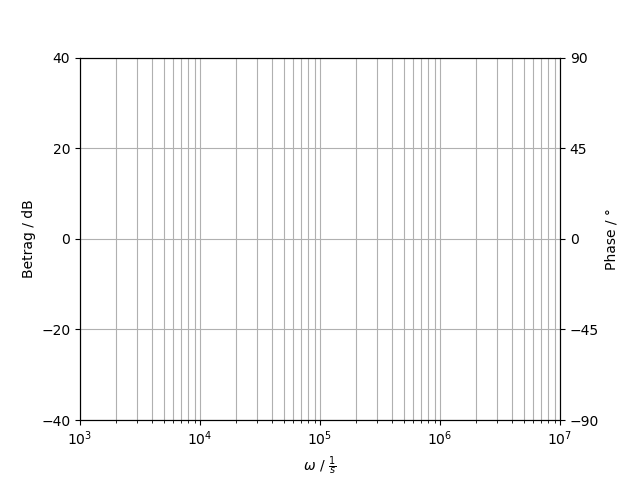
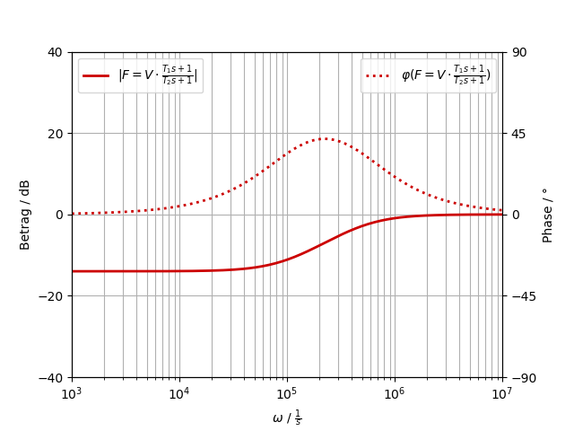
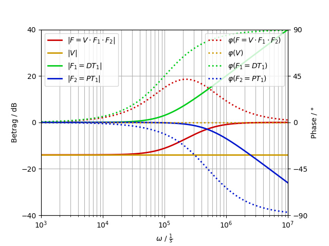

# Regelungstechnik

Create diagramms for control theory in python.

## How to use it

Download `regelungstechnik.py` and `example.py`. The example code should give you a good understanding of how the script works.

## Example

The example code imports `regelungstechnik` and creates transfer functions. It then plots the bode diagramm of these functions.

```python
V = rt.make_V_func(V=0.2)
F_1 = rt.make_DT1_func(T=10e-6)
F_2 = rt.make_PT1_func(T=2e-6)
F = rt.make_prod_func([V, F_1, F_2])
```



An empty bode diagramm can be used as a canvas for hand sketches. It only provides marks on the diagramm axis.



This bode diagramm of the a transfer function `F` shows the absolute value in dB and the phase in degrees as the dotted line. 



This bode diagramm shows `F` and additionaly the transfer function `F` is composed of. 
