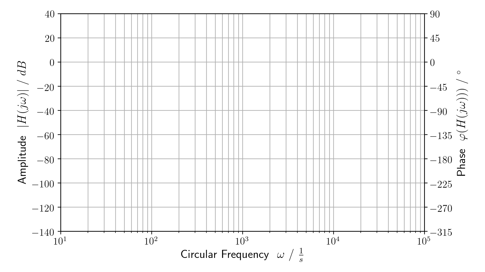
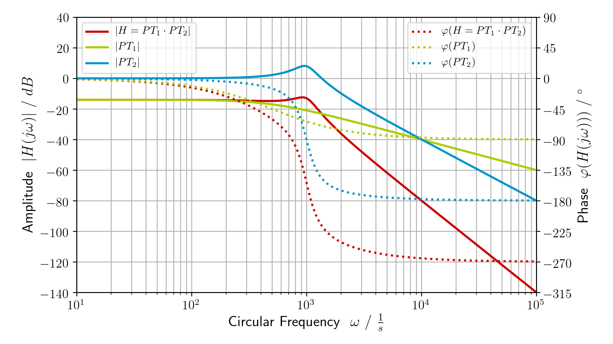
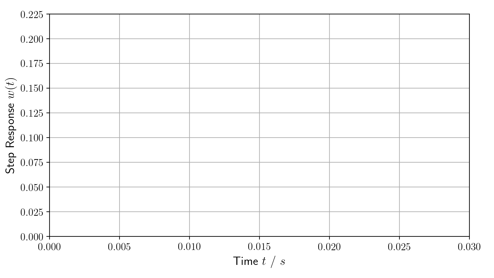
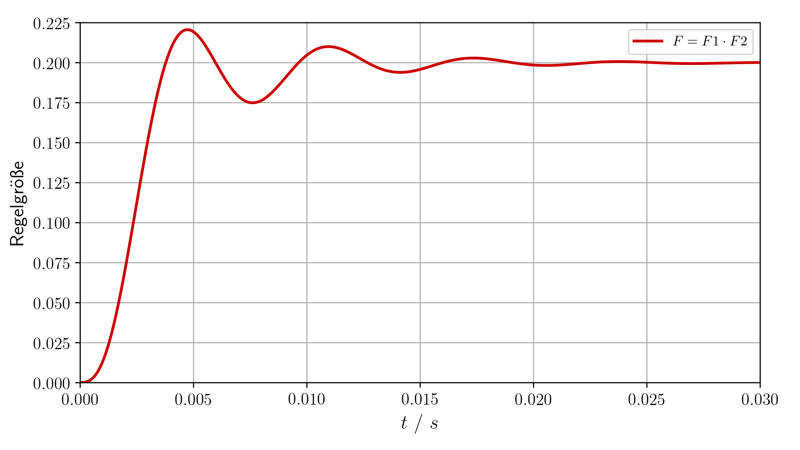
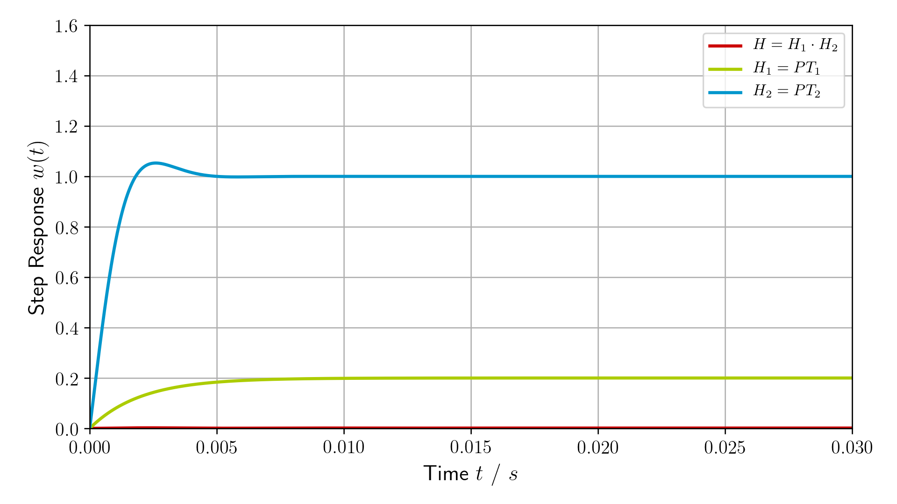

# Regelungstechnik

Create diagrams for control theory in python.

---

**WARNING**
---


- This python module is still under development and may change at any time without notice!
- Currently only the frequency domain is usable (transfer function and bode diagramm). Time domain will leverage `Scipy` with the next updates.

---

## Contents

1. [Getting Started](#getting_started)
2. [Naming](#names)
    1. [Labels](#labels)
    2. [Quantities and Units](#units)
    3. [Time Domain](#time)
    4. [Frequency Domain](#frequency)
    5. [Elements](#elements)
3. [Example](#example)
    1. [Creating Transfer Functions](#example1)
    2. [Creating Bode-Diagrams](#example2)
    3. [Creating Step-Responses](#example3)
4. [Roadmap](#roadmap)
    1. [Overview](#overview)
    2. [Nextup](#nextup)


<a name="getting_started"></a>
## Getting Started

Download `regelungstechnik.py` and `main.py`. The example code in `main.py` should give you a good understanding of how the script works.


<a name="names"></a>
## Naming

In this project, the following naming is used.

<a name="labels"></a>
### Labels

- `Done` - This is a working feature.
- `Limbo` - This feature is currently under development.
- `ToDo` - This feature is on the project wishlist.


<a name="units"></a>
### Quantities and Units

- Gain or damping linear or in Dezibel `[dB]`
- Time `t` in `[s]`.
- Frequency `f` in `[Hz]`
- Circular frequency `omega = 2pi * f` in `[/s]`
- Complex frequency `s = sigma + 1j * omega` in `[/s]`.


<a name="time"></a>
### Time Domain

For sequences in the time domain, lower case letters are used.

- Dirac impulse `delta(t)`
- Unit step `step(t)`
- Ramp `ramp(t)`
- Input `y(t)`
- Output `x(t)`
- Impulse response `h(t)`
- Step response `w(t)`


<a name="frequency"></a>
### Frequency Domain

For sequences in the frequency domain, upper case letters are used.

- Input `Y(s)`
- Output `X(s)`
- Transfer function `H(t)`


<a name="elements"></a>
### Elements

- Gain `P`
- Integrator `I`
- Differentiator `D`
- Low pass `PT1`
- Low pass `PT2`
- Allowance `PD1`


<a name="example"></a>
## Example


<a name="example1"></a>
### Creating Transfer Functions

The example code imports the Regelungstechnik module and creates transfer functions.

```python
import regelungstechnik as rt

F1 = rt.PT1(T=2e-3, V=0.2)
F2 = rt.PT2(omega=1000, D=0.2)
F = rt.prod([F1, F2])
```

These functions are grouped in a list and a list of corresponding labels is added. The labels can use LaTeX formatting.

```python
functions = [F, F1, F2]

labels = [
    r"$F = F1 \cdot F2$",
    r"$F_1 = PT_1$",
    r"$F_2 = PT_2$"
]
```

<a name="example2"></a>
### Creating Bode-Diagrams

Next up, a Bode-Diagram is created and several plots saved. The `ticks` are used for the dB and phase axis. On default they are spaced 20dB / 45° apart.

```python
ticks = [-7, -6, -5, -4, -3, -2, -1, 0, 1, 2]
bode = rt.BodeDiagram(functions, labels, start=1.0, stop=6.0, ticks=ticks)
bode.save(pick=[], path="images/", filename="bode_canvas.png")
bode.save(pick=[0], path="images/", filename="bode_single.png")
bode.save(path="images/", filename="bode_all.png")
```

An empty Bode-Diagram can be used as a canvas for hand sketches. It only provides marks on the diagram axis.



This Bode-Diagram of the transfer function shows the absolute value in dB and the phase in degrees as the dotted line.


This Bode-Diagram shows all the created transfer functions for comparison.



<a name="example3"></a>
### Creating Step-Responses

The last piece of code creates a Step-Response and saves several plots.

```python
step = rt.StepResponse(functions, labels, duration=30e-3)
step.save(pick=[], filename="response_canvas.png", v_max=0.225)
step.save(pick=[0], filename="response_single.png", v_max=0.225)
step.save(filename="response_all.png", v_max=1.6)
```

An empty Step-Response can be used as a canvas for hand sketches. It only provides marks on the diagram axis.



This Step-Response of the transfer function shows how the system reacts to the unit jump.



This Step-Response shows all the created transfer functions for comparison.




<a name="roadmap"></a>
## Roadmap

The goal is to relabel `ToDo` items into `Done` while having as few items as possible in `Limbo`.

<a name="overview"></a>
### Overview

This project contains the following features:

- `Done` Create and evaluate transfer functions
- `Done` Evaluate the impulse response of a transfer function
- `Done` Plot bode diagramms
- `Limbo` Plot step responses
- `ToDo` Add support for all platforms.
- `ToDo` Add a license to the project.
- `ToDo` Plot responses to arbitrary input functions
- `ToDo` Website as GUI
- `ToDo` Videos as explanations


<a name="nextup"></a>
### Nextup

*Leverage `Scipy` with `lti`, `impulse2` and `step2` for elements and time plots.*

- `Limbo` Test elements and diagramms - Step response not working.
- `Done` Fix bode diagramm and step response to work with elements.
- `Done` Refactor composite transfer functions into composite element classes.
- `Done` Add `h(t)` and `w(t)` for `PD1` and add `PD2`.
- `Done` Refactor transfer functions into basic elements that return transfer function or impulse response.
- `Done` Figure out the impulse response of a general `PT2` transfer function.
