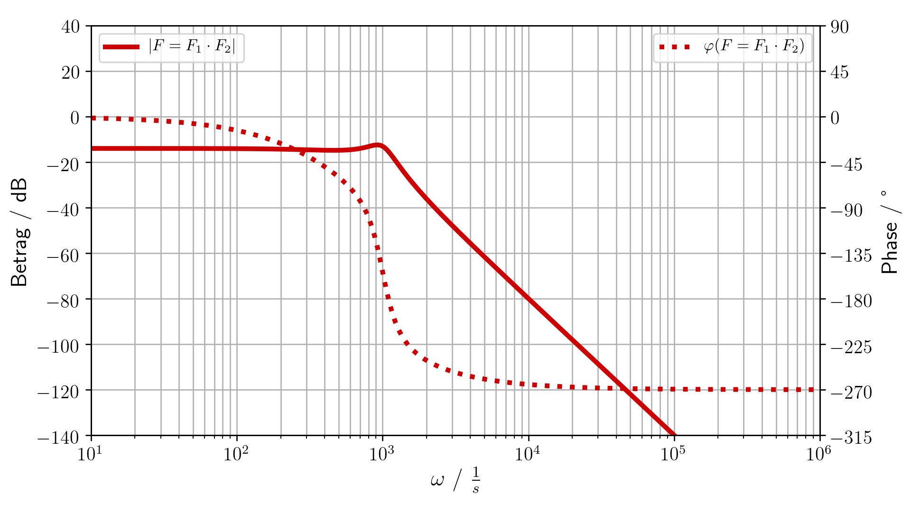
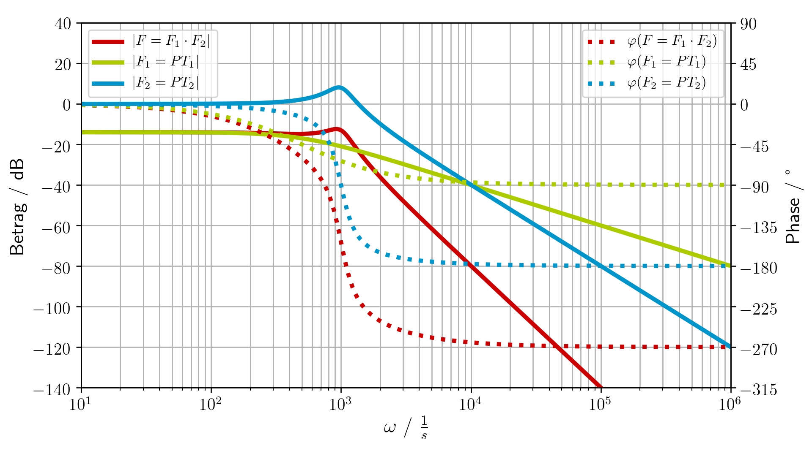

# Regelungstechnik

Create diagramms for control theory in python.

**WARNING**

This python module is still under development and may change at any time without notice!

## How to use it

Download `regelungstechnik.py` and `main.py`. The example code in `main.py` should give you a good understanding of how the script works.

## Example

The example code imports `regelungstechnik as rt` and creates transfer functions. It then plots the bode diagramm of these functions.

```python
F_1 = rt.make_PT1_func(T=2e-3, V=0.2)
F_2 = rt.make_PT2_func(omega=1000, D=0.2)
F = rt.make_prod_func([F_1, F_2])
```


An empty bode diagramm can be used as a canvas for hand sketches. It only provides marks on the diagramm axis.



This bode diagramm of the transfer function `F` shows the absolute value in dB and the phase in degrees as the dotted line. 



This bode diagramm additionally shows all the transfer functions `F` is composed of.
